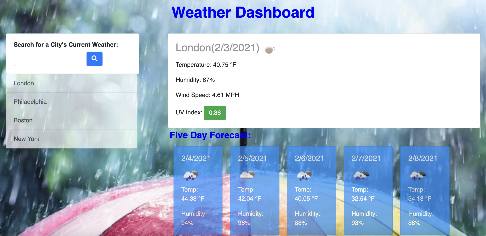
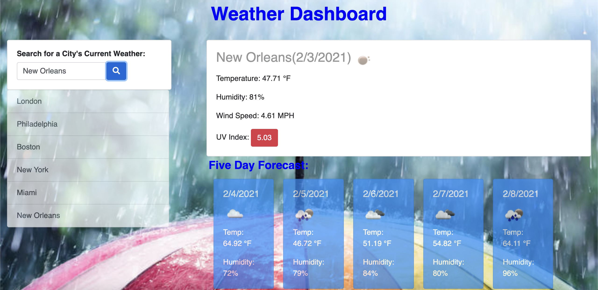

# Weather Dashboard - Task:
Aa a traveler I want to see the weather outlook for multiple cities so that I can plan a trip accordingly.

# The Application:

I was required to create an webpage using the OpeanWeather API that allows a visitor to, upon searching for a city, shows them the current and future conditions for that city. The webpages functions are:

1.) When a user searches for a city, the user is presented with current and future conditions for that city.

2.) That city is then added to the webpage's search history.

3.) When the user views current weather conditions for that city, the user is presented with the city name, the date, an icon representation of weather conditions, the temperature, the humidity, the wind speed, and the UV index.

4.) When the user views the UV index, the user is presented with a color that indicates whether the conditions are favorable, moderate, or severe.

5.) When the user views future weather conditions for that city, the user is presented with a 5-day forecast that displays the date, an icon representation of weather conditions, the temperature, and the humidity.

6.) When the user clicks on a city in the search history, the user is again presented with current and future conditions for that city.

# Link to the website:

https://jonathan-goldstein.github.io/WeatherDashboard/

# Below are images showing the functional webpages:

## The landing page:

## The weather forecast:

